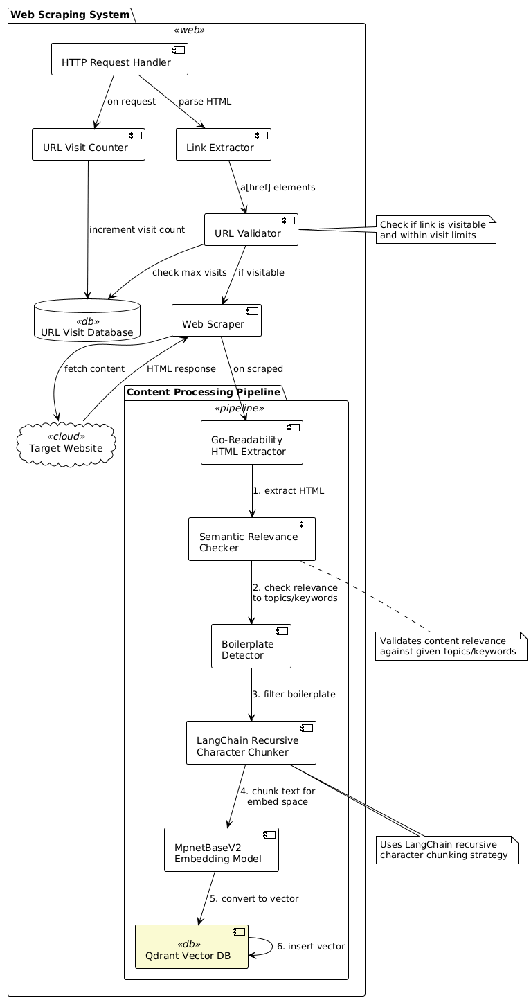

# Axora
An intelligent web crawler that uses semantic similarity to filter relevant content based on search queries. Axora combines traditional web crawling with modern NLP techniques to collect and store only the most relevant web content.

## Crawl

## URL Validation
All links must be carefully validated before downloading. The domain must match the user’s request, and only **HTTPS** is allowed.  
- The path is restricted to `index.php`, `edition.php`, `ads.php`, or `get.php`, 
- and only specific query parameters are accepted: `req`, `id`, `md5`, and `downloadname`.  
- Always validate the full URL (host + path + params) before making a request.  
- For `get.php` redirects, the MD5 in the redirect must match the MD5 in the original request. The redirect URL must match the strict pattern `https://cdn[1..n].booksdl.lc/get.php`, where only the number after `cdn` can vary.  

- when it got redirects (307)   , we need to check:  
- `Content-Disposition` should contain `attachment` with a valid filename.  
- `Content-Range` must not be zero, ensuring actual data is sent.  
- `Content-Type` must be a supported downloadable type (currently only `application/octet-stream`).  

## Download Manager
1. After validation passes, the download begins. Files should be fetched in chunks using the HTTP `Range` header, and each chunk is written directly to disk as it arrives. 
2. The manager must track the last byte saved so downloads can be paused and resumed from that exact point.  
3. If resuming, the next request should start from the last saved offset onward. Once the download completes, the file’s MD5 checksum must be verified against the expected value to ensure integrity.  
4. Optionally, the file can be split into multiple byte ranges and downloaded in parallel threads, then merged afterward to improve speed.  

## Other
ex libgen.io, libgen.org, alternative domains: *.lc, *.li, *.gs, *.vg, *.la, *.bz, *.gl
https://libgen.li/get.php?md5=5e4a98758351903d7412aa5c8cb3aa04&key=8PHX233W8SIWSCEX
https://cdn3.booksdl.lc/get.php?md5=5e4a98758351903d7412aa5c8cb3aa04&key=8PHX233W8SIWSCEX