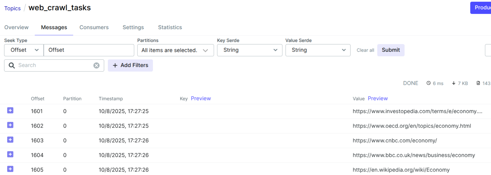

# Axora (Crawl, Scrape, RAG)
RAG by keywords: `GET http://localhost:8080/scrap?q=economy`

conccurent web crawling system designed for concurrent, privacy-focused content collection and processing. The system leverages Tor network for anonymous crawling


## Test


## Python
```
pip install pipreqs
pipreqs /extractor
```
